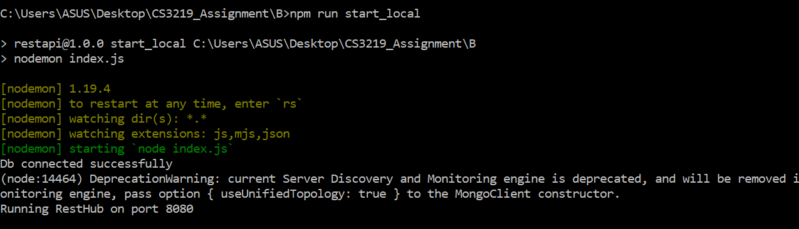

# CS3219 Task B: REST API

## Jack Chen Yu Jie

## TOC

1. [Task B1](#Task-B1)
2. [Task B2](#Task-B2)
3. [Task B3](#Task-B3)

## Task B1

### Task B1:  Implement a simple Javascript backend and REST API to GET, POST,PUT, DELETE 

**Objective**: 

1. Successful GET, POST, PUT, DELETE API calls on localhost using Postman (1.5 marks)
2. Successful GET, POST, PUT, DELETE API calls to deployed endpoints using Postman (1.5 marks)

### Setup

**Requirements**:  NodeJS, PostMan, MongoDb

Use the following commands in your CLI (cmd/terminal) to check that you have all the required applications installed:

````C
// Checking if NodeJS is installed
node -v

// Checking if NPM is installed
npm -v

// Checking if MongoDb is installed
mongo --version
````

If all are installed properly, it should show the following:


**Installation links:**

1. [NodeJS](https://nodejs.org/en/download/)
   1. Refer to this [url](https://docs.npmjs.com/downloading-and-installing-node-js-and-npm) for instructions on how to install `node` and `npm`
2. [MongoDb](https://www.mongodb.com/try#community)
   1. [Windows](https://docs.npmjs.com/downloading-and-installing-node-js-and-npm)
   2. [macOS](https://docs.mongodb.com/manual/tutorial/install-mongodb-on-os-x/)
   3. [Linux](https://docs.mongodb.com/manual/administration/install-on-linux/)

3. [Postman](https://www.postman.com/downloads/)


### Instructions on running API Locally

To demonstrate REST API, we create a simple web application which is essentially a contact list with CRUD functions to create, view, edit and delete contacts with basic information such as name, gender, email and phone number is created.

To demonstrate the simple Javascript backend and REST API to GET, POST, PUT, DELETE, first fork and clone this repository into your local machine. 

Navigate to the root directory of the project and follow the instructions below:

1. **Start the local instance of MongoDb by running the following command in your CLI**

   ````C
   // Windows
   mongod 
   
   // Mac (if you installed it through HomeBrew)
   brew services start mongodb-community
   ````

   

2. **Install dependencies and start the express-server** 

   ````C
   // Install dependencies
   npm install
       
   // Start the express-server using pre-defined script in package.json
   npm run start_local
   ````

   if all is done correct, you should see a success message such as the one shown in the screenshot below:
   

3. **Open up your favourite browser and type in `localhost:8080`**

   


#### Instructions to demonstrate GET, POST, PUT, DELETE API on Postman

After starting the node server and mongodb, we can now show the GET, POST, PUT, DELETE API on Postman.

Open up your Postman application and it should show something like this:


We can demonstrate the REST API methods using Postman to send requests to the API

1. **GET** Requests

   1. **View all contacts**
      1. **GET** request to `localhost:8080/api/contacts`
   2.  **View a single contact**
      1. **GET** request to `localhost:8080/api/contacts/{contact_id}` where `{contact_id}` is the contact's id 

   
   
2. **POST** Request

   1. **Create a contact**

      1. **POST** Request to `localhost:8080/api/contacts`
         You need to prove the following `String` fields under the `Body` section:
         1. `name`
         2. `gender`
         3. `email`
         4. `phone`

      

3. **PUT** Request

   1. **Change information of contact**
      1. **PUT** Request to `localhost:8080/api/contacts/{contact_id}` where `{contact_id}` is the contact's id which you can get from the `_id` field of the contact data

   
   
4. **DELETE** request

   1. **Delete a contact**
      1. **DELETE** Request `localhost:8080/api/contacts/{contact_id}` where `{contact_id}` is the contact's id which you can get from the `_id` field of the contact data

   


## Task B2

### Task B2: Write simple test cases for API and use a CI tool (Travis, etc) to automate testing. 

**Objective**: 

1. Demonstrate use of testing for API using Mocha/Chai, or any other testing framework (1.5 marks)
2. Demonstrate ability to use Travis or any other CI tool to automate testing (1.5 mark)


### Demonstrate testing for API using Mocha/Chai

After using Postman to show the GET, POST, PUT and DELETE methods of our REST API, we can run the test.js is in the repository.

Stop the CLI that is currently running the `start_local`script

We can then run the test by running the script `test` by executing the following command:

````
npm run test
````

You should see the following on your CLI:


### Demonstrate ability to use Travis or any other CI tool to automate testing

We added the `.travis.yml` file to our repository to enable Travis CI build. This will automate the testing everytime we commit and push to the repository. Some screenshots are shown below:


The screenshot above shows any error or that all tests have passed when we push a commit to the repository on Github.


## Task B3

### Task B3: Use CD tool for automated deployment to a serverless service

**Objective**: 

1. Demonstrate ability to automatically deploy tool to a serverless service (e.g. AWS Lambda or Google Cloud Functions) (3 marks)
2. 

